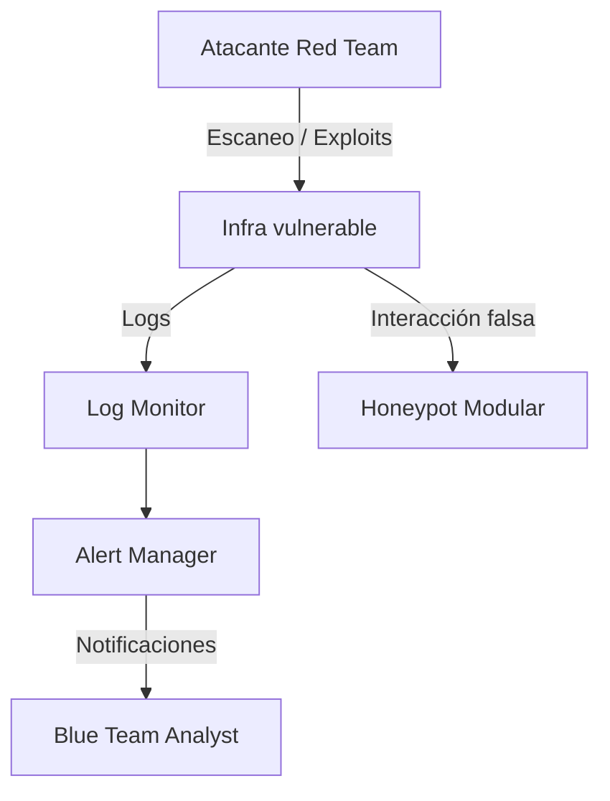

# ⚔️ Cyber Ultra Instinct – Framework de Ciberseguridad Total

Bienvenido al **Master of Masters de la ciberseguridad**.  
Este proyecto no es un simple repo de hacking: es un **framework ofensivo y defensivo** diseñado para entrenar, automatizar y evolucionar técnicas de Red Team y Blue Team en un laboratorio realista.

🔴 **Red Team** → Explora, ataca, explota y mueve ficha como un atacante real.  
🔵 **Blue Team** → Detecta, responde, analiza y contraataca con honeypots, SIEM y scripts defensivos.  

---

## 🚀 Características

- Escaneo multi-hilo con fingerprinting automático.
- Fuerza bruta SSH avanzada con hilos + reintentos inteligentes.
- Reverse shell en Python con cifrado AES.
- Honeypot modular con registro de intentos y alertas en tiempo real.
- Detección de port scanning con logging y notificaciones.
- Despliegue automático del laboratorio con Ansible/Terraform.
- Documentación detallada estilo **paper académico** + diagramas de arquitectura.

---

## 🧠 Arquitectura

