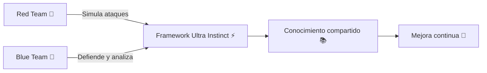

# 📘 Introducción

## 🔎 Contexto
La ciberseguridad es un campo en constante evolución, donde los atacantes desarrollan nuevas técnicas de intrusión mientras los defensores mejoran sus mecanismos de detección y respuesta.  
En este entorno, surge la necesidad de contar con **laboratorios prácticos** que permitan experimentar con ataques y defensas en un entorno controlado y seguro.

El **Framework Cyber Ultra Instinct** nace con el propósito de integrar en un mismo repositorio:
- Herramientas ofensivas (*Red Team*).
- Herramientas defensivas (*Blue Team*).
- Documentación académica que acompañe cada módulo.
- Ejercicios reproducibles para formación y práctica.

---

## 🎯 Objetivos

### Objetivo general
Desarrollar un laboratorio integral de hacking ético que combine técnicas ofensivas y defensivas en un entorno automatizado.

### Objetivos específicos
1. Diseñar un repositorio modular con documentación clara y estructurada.
2. Implementar scripts ofensivos (escaneo, fuerza bruta, reverse shells).
3. Implementar scripts defensivos (honeypots, monitorización, alertas).
4. Automatizar el despliegue de entornos con Ansible y Terraform.
5. Proporcionar guías para la reproducción de ataques y defensas.
6. Definir líneas de investigación futuras (IA, multinube, threat intelligence).

---

## 🧩 Filosofía Red Team vs Blue Team
- **Red Team** → pensar como un atacante: descubrir vulnerabilidades, explotarlas y demostrar el impacto.  
- **Blue Team** → defender como un profesional: detectar anomalías, responder y aprender del adversario.  

Este framework combina ambas filosofías para lograr un **entrenamiento completo**.

---

## ⚖️ Alcance
- Uso en **entornos de laboratorio** (máquinas virtuales o nubes privadas).  
- Diseñado para estudiantes, investigadores y profesionales.  
- No pretende ser un framework de producción, sino un **entorno formativo y experimental**.

---

## ⚠️ Aviso legal
Este proyecto es **exclusivamente educativo**.  
El uso en sistemas de terceros sin autorización es ilegal y contrario a la ética profesional.

