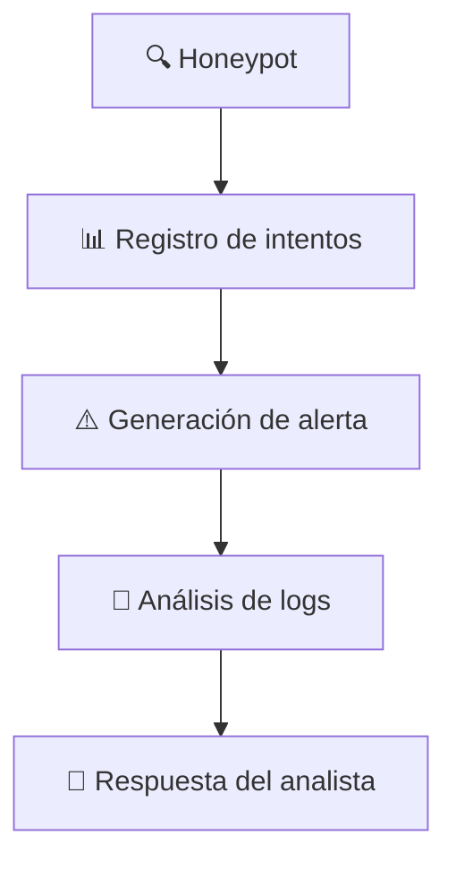

# 🔵 Blue Team – Operaciones Defensivas

## 🌐 Introducción
El **Blue Team** es el encargado de proteger, detectar y responder frente a los ataques simulados por el Red Team.  
Dentro de este framework, el objetivo principal es **detectar comportamientos anómalos**, registrar evidencia y analizar patrones de ataque.

La defensa se basa en tres pilares:
1. **Engaño** → honeypots diseñados para atraer atacantes.  
2. **Detección temprana** → identificación de patrones de escaneo o intentos de intrusión.  
3. **Análisis forense** → monitorización y registro de eventos sospechosos.  

---

## 🎯 Objetivos del Blue Team
1. Registrar intentos de ataque en tiempo real.  
2. Correlacionar eventos ofensivos con alertas defensivas.  
3. Proporcionar información útil para la respuesta a incidentes.  
4. Entrenar la capacidad de reacción frente a escenarios comunes.  

---

## 🛡️ Módulos defensivos incluidos

### 1. Honeypot básico – `honeypot_basic.py`
- Simula un servicio vulnerable accesible al atacante.  
- Registra cada intento de conexión (usuario, IP, timestamp).  
- Ideal para captar intentos de fuerza bruta SSH.  

Ejemplo de ejecución:
```bash
python3 defense/honeypot_basic.py -p 22
```
Salida esperada:
```text
[!] Conexión detectada desde 192.168.1.50
Usuario: root | Contraseña: admin123
```
2. Detección de escaneo – detect_scan.py

Monitoriza patrones de tráfico asociados a escaneos masivos.

Permite identificar el uso de herramientas como Nmap.

Ejemplo de ejecución:
```bash
sudo python3 defense/detect_scan.py -i eth0
```
Posible alerta:
```bash
[ALERTA] Escaneo detectado desde 192.168.1.50 en puerto 22
```

3. Monitor de logs – log_monitor.py

Revisa archivos de log en busca de patrones sospechosos.

Permite detectar accesos fallidos, conexiones persistentes y actividad extraña.

Ejemplo de ejecución:
```bash
python3 defense/log_monitor.py -f /var/log/auth.log
```
Posible salida:
```text
[!] Intentos múltiples de login detectados desde 192.168.1.50
```
🔄 Flujo Blue Team


📚 Casos prácticos

Caso 1 – Ataque de fuerza bruta SSH

Red Team ejecuta `bruteforce_ssh.py`.

Blue Team registra `intentos en honeypot_basic.py`.

`log_monitor.py` detecta patrones de login repetidos.

Caso 2 – Escaneo masivo

Red Team lanza `scanner.py`.

Blue Team detecta el patrón en `detect_scan.py`.

Caso 3 – Conexión persistente

Red Team establece `reverse_shell.py`.

Blue Team revisa logs con `log_monitor.py` y activa alerta.

⚖️ Consideraciones

Este framework no sustituye un SIEM corporativo.

Los honeypots deben configurarse en entornos aislados.

El valor principal está en la visibilidad y el aprendizaje frente a ataques comunes

