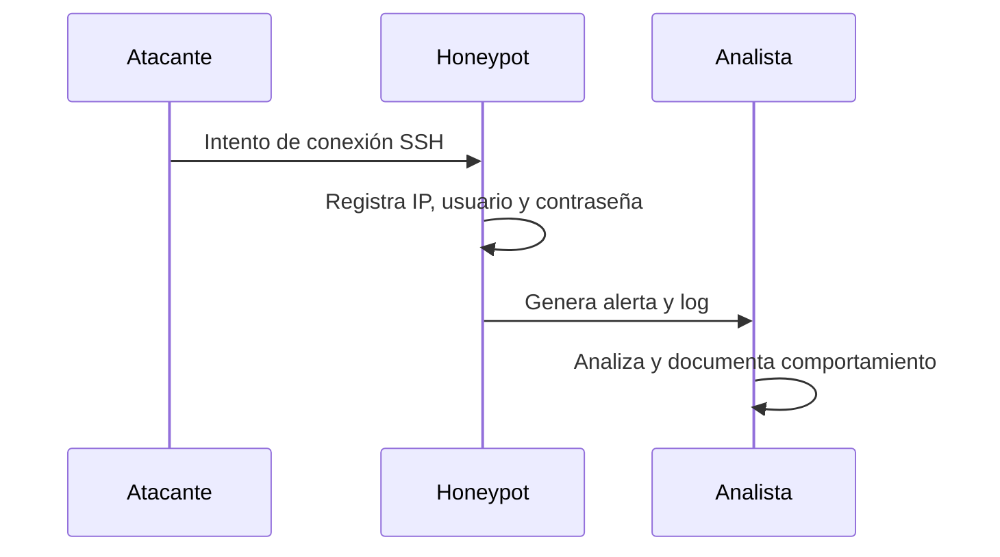

# 🪤 Honeypots – Ingeniería del Engaño

## 🌐 Introducción
Un **honeypot** es un sistema diseñado para parecer vulnerable y atraer a los atacantes.  
Su función principal no es la de proteger directamente, sino **registrar, aprender y analizar** los comportamientos maliciosos en un entorno controlado.

El uso de honeypots es una técnica clave en ciberseguridad, especialmente en **detección temprana** y **inteligencia de amenazas**.  
Este framework incluye un honeypot básico, pensado para la formación y simulación de escenarios ofensivos y defensivos.

---

## 🎯 Objetivos de un honeypot
1. Atraer atacantes y recopilar información sobre sus técnicas.  
2. Servir como **señuelo** para desviar la atención de sistemas reales.  
3. Proporcionar datos para el análisis forense y la mejora de defensas.  
4. Facilitar el aprendizaje práctico en entornos de laboratorio.  

---

## 🛡️ Tipos de honeypots
1. **Baja interacción**  
   - Simulan servicios básicos (ej: SSH falso).  
   - Bajo riesgo, fácil de implementar.  

2. **Alta interacción**  
   - Sistemas completos con vulnerabilidades reales.  
   - Mayor realismo, pero también mayor riesgo.  

3. **Honeynets**  
   - Redes completas de honeypots interconectados.  
   - Usados en investigación avanzada y threat intelligence.  

---

## ⚙️ Honeypot básico en el framework

### Script: `honeypot_basic.py`
Características:
- Simula un servicio SSH falso.  
- Registra usuario, contraseña y dirección IP de cada intento.  
- Genera logs útiles para el **Blue Team**.  

Ejemplo de ejecución:
```bash
python3 defense/honeypot_basic.py -p 22
```
Ejemplo de log generado:
´´´text
[2025-09-04 10:15:33] Conexión detectada desde 192.168.1.50
Usuario: root | Contraseña: admin123
´´´

🔄 ***Flujo de un ataque contra honeypot***



***📚 Caso práctico***

1. El atacante ejecuta `bruteforce_ssh.py` contra el honeypot.

2. El honeypot registra todos los intentos con sus credenciales.

3. El analista revisa los logs y observa patrones como:

  - Usuarios más probados (ej: root, admin).

  - Contraseñas más comunes (ej: 123456, admin123).

4. El Blue Team utiliza estos datos para actualizar defensas.

***⚖️ Consideraciones y riesgos***

Un honeypot no debe usarse en producción sin aislamiento adecuado.

Es necesario proteger la red real con firewalls para evitar pivoting.

Los datos capturados deben tratarse de acuerdo a normativas de privacidad y seguridad.

***🚀 Aplicaciones futuras***

Integración con sistemas de visualización en dashboards.

Uso de honeypots distribuidos en nubes híbridas.

Conexión con plataformas de threat intelligence (ej: OpenCTI, MISP).
