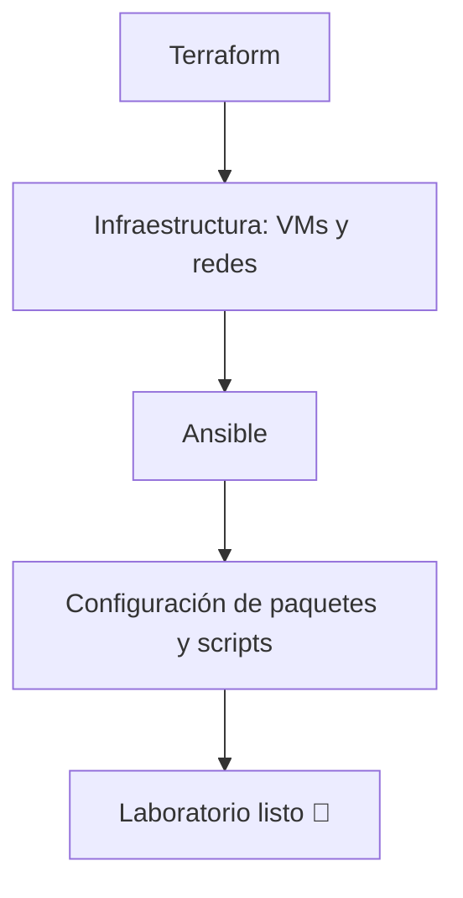

# ⚙️ Automatización del Laboratorio

## 🌐 Introducción
La automatización es un componente esencial en este framework, ya que permite:
- Reproducir entornos de ataque y defensa de manera consistente.  
- Reducir errores de configuración manual.  
- Escalar el laboratorio en distintos entornos (local, nube o contenedores).  

Para lograrlo se utilizan dos tecnologías clave:
1. **Ansible** → automatización de configuración.  
2. **Terraform** → provisión de infraestructura.  

---

## 🎯 Objetivos de la automatización
1. Permitir la instalación rápida de todos los componentes del framework.  
2. Asegurar que Red Team y Blue Team puedan desplegar sus entornos bajo demanda.  
3. Proveer una base extensible para añadir nuevos módulos.  

---

## 📂 Archivos incluidos

### 1. `automation/ansible_playbook.yml`
- Instala dependencias necesarias (Python, librerías, paquetes de red).  
- Configura servicios básicos en las VMs del laboratorio.  
- Despliega scripts ofensivos y defensivos en las rutas correctas.  

Ejemplo de ejecución:
```bash
ansible-playbook -i hosts automation/ansible_playbook.yml
```
2. `automation/terraform_setup.tf`

- Crea máquinas virtuales en un proveedor de nube o en local con libvirt / VirtualBox.

- Define recursos de red (subredes, reglas de firewall, direcciones IP).

- Permite levantar rápidamente entornos aislados para pruebas.

Ejemplo de ejecución:
```bash
terraform init
terraform apply -auto-approve
```
**🔄 Flujo de despliegue automatizado**



***📚 Caso práctico***

1. El analista ejecuta `terraform apply` para crear:

- 1 máquina atacante (Kali Linux).

- 1 máquina defensora (Ubuntu con honeypot).

- 1 red privada virtual.

2. Una vez creadas, se lanza:
```bash
ansible-playbook -i hosts automation/ansible_playbook.yml
```
- Se instalan dependencias
- Se despliegan los scripts de Red Team y Blue Team.

3. Resultado
- Laboratorio operativo en pocos minutos.
- Listo para pruebas ofensivas y defensivas

---
***⚖️ Consideraciones***

Es necesario adaptar los inventarios de Ansible y variables de Terraform al entorno de cada usuario.

Puede integrarse con Docker o Kubernetes para entornos más complejos.

No sustituye a un despliegue corporativo, pero permite entrenar con gran realismo.

---
***🚀 Futuras integraciones***

Automatización completa con CI/CD en GitHub Actions.

Integración con contenedores Docker para laboratorios ligeros.

Compatibilidad con múltiples nubes (AWS, Azure, GCP).

